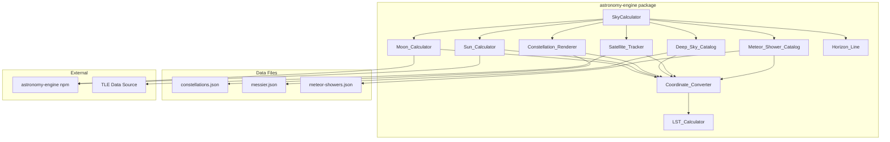

# Design Document: Enhanced Celestial Objects

## Overview

This design extends the stargazing-app's astronomy-engine package to support additional celestial objects beyond stars and planets. The enhancement adds horizon line visualization, Moon position/phase calculation, Sun position with safety warnings, constellation line patterns, deep sky objects (Messier catalog), satellite/ISS tracking, and meteor shower radiants.

The design follows the existing architecture patterns:
- New calculator modules in `packages/astronomy-engine/src/`
- Data catalogs stored as JSON in `packages/astronomy-engine/data/`
- Extended `SkyPositions` interface for unified position access
- Reuse of existing `Coordinate_Converter` for all RA/Dec to Az/Alt transformations
- Integration with the `astronomy-engine` npm package for ephemeris calculations

## Architecture



## Components and Interfaces

### 1. Horizon_Line Module

Generates horizon line points at altitude 0° for rendering.

```typescript
// packages/astronomy-engine/src/horizon-line.ts

export interface HorizonPoint {
  azimuth: number;      // 0-360 degrees
  altitude: number;     // Always 0
  screenX?: number;     // Populated by renderer
  screenY?: number;
}

export interface HorizonLineConfig {
  pointCount: number;   // Number of points (default: 360)
  color: string;        // Line color (default: '#4a5568')
  opacity: number;      // Line opacity (default: 0.6)
}

export interface HorizonLine {
  /**
   * Generates horizon points at altitude 0° across all azimuths
   */
  getHorizonPoints(): HorizonPoint[];
  
  /**
   * Checks if an object is below the horizon
   */
  isBelowHorizon(altitude: number): boolean;
  
  /**
   * Gets the configuration
   */
  getConfig(): HorizonLineConfig;
  
  /**
   * Updates configuration
   */
  setConfig(config: Partial<HorizonLineConfig>): void;
}

export function createHorizonLine(config?: Partial<HorizonLineConfig>): HorizonLine;
```

### 2. Moon_Calculator Module

Computes Moon position and phase using the astronomy-engine npm package.

```typescript
// packages/astronomy-engine/src/moon-calculator.ts

export type LunarPhaseName = 
  | 'New Moon'
  | 'Waxing Crescent'
  | 'First Quarter'
  | 'Waxing Gibbous'
  | 'Full Moon'
  | 'Waning Gibbous'
  | 'Last Quarter'
  | 'Waning Crescent';

export interface MoonPosition {
  ra: number;                    // Right Ascension in hours (0-24)
  dec: number;                   // Declination in degrees (-90 to +90)
  azimuth: number;               // Horizontal azimuth (0-360)
  altitude: number;              // Horizontal altitude (-90 to +90)
  phaseName: LunarPhaseName;     // Current phase name
  illumination: number;          // Illumination percentage (0-100)
  magnitude: number;             // Apparent magnitude
  isBelowHorizon: boolean;       // True if altitude < 0
}

export interface MoonCalculator {
  /**
   * Calculates Moon position and phase for given time and location
   */
  calculate(
    timestamp: Date,
    observer: GeographicCoordinates,
    lst: number
  ): MoonPosition;
}

export function createMoonCalculator(): MoonCalculator;
```

### 3. Sun_Calculator Module

Computes Sun position with twilight status and safety warnings.

```typescript
// packages/astronomy-engine/src/sun-calculator.ts

export type SkyStatus = 'daylight' | 'twilight' | 'night';

export interface SunPosition {
  ra: number;                    // Right Ascension in hours (0-24)
  dec: number;                   // Declination in degrees (-90 to +90)
  azimuth: number;               // Horizontal azimuth (0-360)
  altitude: number;              // Horizontal altitude (-90 to +90)
  status: SkyStatus;             // Current sky status
  safetyWarning: boolean;        // True if altitude > -18°
  isBelowHorizon: boolean;       // True if altitude < 0
}

export interface SunCalculator {
  /**
   * Calculates Sun position and safety status
   */
  calculate(
    timestamp: Date,
    observer: GeographicCoordinates,
    lst: number
  ): SunPosition;
  
  /**
   * Gets sky status based on Sun altitude
   */
  getSkyStatus(sunAltitude: number): SkyStatus;
}

export function createSunCalculator(): SunCalculator;
```

### 4. Constellation_Renderer Module

Manages constellation line data and visibility calculations.

```typescript
// packages/astronomy-engine/src/constellation-renderer.ts

export interface ConstellationStar {
  hipId: string;                 // Hipparcos catalog ID
  ra: number;                    // RA in hours
  dec: number;                   // Dec in degrees
}

export interface ConstellationLine {
  star1: ConstellationStar;
  star2: ConstellationStar;
}

export interface Constellation {
  id: string;                    // IAU abbreviation (e.g., 'ORI')
  name: string;                  // Full name (e.g., 'Orion')
  lines: ConstellationLine[];    // Line segments
  centerRA: number;              // Center RA for label placement
  centerDec: number;             // Center Dec for label placement
}

export interface ConstellationLineSegment {
  constellationId: string;
  constellationName: string;
  start: HorizontalCoordinates;
  end: HorizontalCoordinates;
  isPartiallyVisible: boolean;   // True if one end is below horizon
}

export interface ConstellationRendererConfig {
  enabled: boolean;
  lineColor: string;
  lineThickness: number;
  showNames: boolean;
}

export interface ConstellationRenderer {
  /**
   * Gets all 88 IAU constellations
   */
  getConstellations(): Constellation[];
  
  /**
   * Calculates visible constellation line segments
   */
  getVisibleLines(
    observer: GeographicCoordinates,
    lst: number
  ): ConstellationLineSegment[];
  
  /**
   * Gets constellation center positions for labels
   */
  getConstellationCenters(
    observer: GeographicCoordinates,
    lst: number
  ): Map<string, HorizontalCoordinates>;
  
  /**
   * Gets/sets configuration
   */
  getConfig(): ConstellationRendererConfig;
  setConfig(config: Partial<ConstellationRendererConfig>): void;
}

export function createConstellationRenderer(): ConstellationRenderer;
```

### 5. Deep_Sky_Catalog Module

Provides access to Messier objects with position calculations.

```typescript
// packages/astronomy-engine/src/deep-sky-catalog.ts

export type DeepSkyObjectType = 
  | 'Galaxy'
  | 'Nebula'
  | 'Open Cluster'
  | 'Globular Cluster'
  | 'Planetary Nebula';

export interface DeepSkyObject {
  id: string;                    // Messier number (e.g., 'M31')
  name: string | null;           // Common name (e.g., 'Andromeda Galaxy')
  ra: number;                    // RA in hours
  dec: number;                   // Dec in degrees
  magnitude: number;             // Apparent magnitude
  type: DeepSkyObjectType;       // Object classification
}

export interface DeepSkyPosition {
  object: DeepSkyObject;
  azimuth: number;
  altitude: number;
  isVisible: boolean;            // Above horizon and within magnitude limit
}

export interface DeepSkyCatalogConfig {
  maxMagnitude: number;          // Visibility threshold (default: 10.0)
}

export interface DeepSkyCatalog {
  /**
   * Gets all 110 Messier objects
   */
  getAllObjects(): DeepSkyObject[];
  
  /**
   * Gets objects by type
   */
  getObjectsByType(type: DeepSkyObjectType): DeepSkyObject[];
  
  /**
   * Gets object by ID
   */
  getObject(id: string): DeepSkyObject | null;
  
  /**
   * Calculates positions for visible objects
   */
  getVisibleObjects(
    observer: GeographicCoordinates,
    lst: number,
    maxMagnitude?: number
  ): DeepSkyPosition[];
  
  /**
   * Gets/sets configuration
   */
  getConfig(): DeepSkyCatalogConfig;
  setConfig(config: Partial<DeepSkyCatalogConfig>): void;
}

export function createDeepSkyCatalog(): DeepSkyCatalog;
```

### 6. Satellite_Tracker Module

Calculates satellite positions from TLE data.

```typescript
// packages/astronomy-engine/src/satellite-tracker.ts

export interface TLEData {
  name: string;
  line1: string;
  line2: string;
  fetchedAt: Date;
}

export interface SatellitePosition {
  id: string;
  name: string;
  azimuth: number;
  altitude: number;
  range: number;                 // Distance in km
  isVisible: boolean;            // Illuminated and observer in darkness
  isStale: boolean;              // TLE data > 14 days old
}

export interface SatelliteTrackerConfig {
  staleDays: number;             // Days before TLE is stale (default: 14)
}

export type SatelliteTrackerError = 
  | { type: 'TLE_UNAVAILABLE'; satelliteId: string }
  | { type: 'TLE_INVALID'; satelliteId: string; reason: string }
  | { type: 'TLE_STALE'; satelliteId: string; age: number };

export interface SatelliteTracker {
  /**
   * Adds or updates TLE data for a satellite
   */
  setTLE(id: string, tle: TLEData): void;
  
  /**
   * Gets TLE data for a satellite
   */
  getTLE(id: string): TLEData | null;
  
  /**
   * Checks if TLE data is stale
   */
  isTLEStale(id: string): boolean;
  
  /**
   * Calculates satellite position
   * Returns error status if TLE unavailable/invalid
   */
  calculate(
    id: string,
    timestamp: Date,
    observer: GeographicCoordinates
  ): SatellitePosition | SatelliteTrackerError;
  
  /**
   * Calculates positions for all tracked satellites
   */
  calculateAll(
    timestamp: Date,
    observer: GeographicCoordinates,
    sunPosition: SunPosition
  ): Map<string, SatellitePosition | SatelliteTrackerError>;
  
  /**
   * Predicts visibility based on satellite illumination and observer darkness
   */
  predictVisibility(
    satelliteAltitude: number,
    sunPosition: SunPosition
  ): boolean;
  
  /**
   * Gets list of tracked satellite IDs
   */
  getTrackedSatellites(): string[];
  
  /**
   * Loads default ISS TLE
   */
  loadDefaultISS(): Promise<void>;
}

export function createSatelliteTracker(config?: Partial<SatelliteTrackerConfig>): SatelliteTracker;
```

### 7. Meteor_Shower_Catalog Module

Provides meteor shower radiant data with activity status.

```typescript
// packages/astronomy-engine/src/meteor-shower-catalog.ts

export interface MeteorShower {
  id: string;                    // Identifier (e.g., 'PER' for Perseids)
  name: string;                  // Full name
  ra: number;                    // Radiant RA in hours
  dec: number;                   // Radiant Dec in degrees
  peakMonth: number;             // Peak month (1-12)
  peakDay: number;               // Peak day of month
  zhr: number;                   // Zenithal Hourly Rate at peak
}

export interface MeteorShowerPosition {
  shower: MeteorShower;
  azimuth: number;
  altitude: number;
  isActive: boolean;             // Within 7 days of peak
  daysFromPeak: number;          // Negative = before peak
}

export interface MeteorShowerCatalog {
  /**
   * Gets all meteor showers
   */
  getAllShowers(): MeteorShower[];
  
  /**
   * Gets active showers (within 7 days of peak)
   */
  getActiveShowers(currentDate: Date): MeteorShower[];
  
  /**
   * Calculates radiant positions
   */
  getRadiantPositions(
    currentDate: Date,
    observer: GeographicCoordinates,
    lst: number
  ): MeteorShowerPosition[];
  
  /**
   * Checks if a shower is active
   */
  isShowerActive(shower: MeteorShower, currentDate: Date): boolean;
  
  /**
   * Gets days from peak (negative = before)
   */
  getDaysFromPeak(shower: MeteorShower, currentDate: Date): number;
}

export function createMeteorShowerCatalog(): MeteorShowerCatalog;
```

### 8. Extended SkyPositions Interface

Updated interface to include all new celestial object types.

```typescript
// packages/astronomy-engine/src/sky-calculator.ts (updated)

export interface SkyPositions {
  // Existing fields
  starPositions: Map<string, HorizontalCoordinates>;
  planetPositions: Map<string, HorizontalCoordinates>;
  lst: number;
  timestamp: Date;
  
  // New fields
  horizonPoints: HorizonPoint[];
  moonPosition: MoonPosition | null;
  sunPosition: SunPosition | null;
  deepSkyPositions: Map<string, DeepSkyPosition>;
  satellitePositions: Map<string, SatellitePosition | SatelliteTrackerError>;
  meteorShowerRadiants: Map<string, MeteorShowerPosition>;
  constellationLines: ConstellationLineSegment[];
}
```

## Data Models

### Constellation Data (constellations.json)

```json
{
  "constellations": [
    {
      "id": "ORI",
      "name": "Orion",
      "lines": [
        { "star1": "HIP26727", "star2": "HIP27989" },
        { "star1": "HIP27989", "star2": "HIP26311" }
      ],
      "stars": {
        "HIP26727": { "ra": 5.6033, "dec": -1.2019 },
        "HIP27989": { "ra": 5.9195, "dec": 7.4070 },
        "HIP26311": { "ra": 5.5334, "dec": -0.2991 }
      }
    }
  ]
}
```

### Messier Catalog (messier.json)

```json
{
  "objects": [
    {
      "id": "M1",
      "name": "Crab Nebula",
      "ra": 5.5753,
      "dec": 22.0145,
      "magnitude": 8.4,
      "type": "Nebula"
    },
    {
      "id": "M31",
      "name": "Andromeda Galaxy",
      "ra": 0.7123,
      "dec": 41.2689,
      "magnitude": 3.4,
      "type": "Galaxy"
    }
  ]
}
```

### Meteor Shower Data (meteor-showers.json)

```json
{
  "showers": [
    {
      "id": "QUA",
      "name": "Quadrantids",
      "ra": 15.33,
      "dec": 49.5,
      "peakMonth": 1,
      "peakDay": 4,
      "zhr": 120
    },
    {
      "id": "PER",
      "name": "Perseids",
      "ra": 3.07,
      "dec": 58.0,
      "peakMonth": 8,
      "peakDay": 12,
      "zhr": 100
    }
  ]
}
```


## Correctness Properties

*A property is a characteristic or behavior that should hold true across all valid executions of a system—essentially, a formal statement about what the system should do. Properties serve as the bridge between human-readable specifications and machine-verifiable correctness guarantees.*

### Property 1: Horizon Altitude Invariant

*For any* horizon line configuration and any generated horizon point, the altitude value SHALL always equal exactly 0 degrees, and the azimuth values SHALL cover the full range from 0 to 360 degrees.

**Validates: Requirements 1.1**

### Property 2: Below Horizon Flag Correctness

*For any* celestial object with a calculated altitude, the `isBelowHorizon` flag SHALL be `true` if and only if the altitude is less than 0 degrees.

**Validates: Requirements 1.4**

### Property 3: Celestial Body RA/Dec Validity

*For any* timestamp and observer location, the Moon_Calculator and Sun_Calculator SHALL return Right Ascension values in the range [0, 24) hours and Declination values in the range [-90, +90] degrees.

**Validates: Requirements 2.1, 3.1**

### Property 4: Moon Phase Name Validity

*For any* timestamp, the Moon_Calculator SHALL return a phase name that is exactly one of the eight valid lunar phases: New Moon, Waxing Crescent, First Quarter, Waxing Gibbous, Full Moon, Waning Gibbous, Last Quarter, or Waning Crescent.

**Validates: Requirements 2.2**

### Property 5: Moon Illumination Bounds

*For any* timestamp, the Moon_Calculator SHALL return an illumination percentage in the range [0, 100].

**Validates: Requirements 2.3**

### Property 6: Moon Magnitude Validity

*For any* timestamp, the Moon_Calculator SHALL return a finite numeric magnitude value that correlates with the illumination (brighter/lower magnitude when more illuminated).

**Validates: Requirements 2.5**

### Property 7: Sun Status and Safety Flag Correctness

*For any* calculated Sun altitude:
- If altitude > 0°, status SHALL be 'daylight'
- If -18° < altitude ≤ 0°, status SHALL be 'twilight'  
- If altitude ≤ -18°, status SHALL be 'night'
- safetyWarning SHALL be `true` if and only if altitude > -18°

**Validates: Requirements 3.2, 3.3, 3.4, 3.5**

### Property 8: Constellation Partial Visibility

*For any* constellation line segment where one endpoint star has altitude < 0 and the other has altitude ≥ 0, the `isPartiallyVisible` flag SHALL be `true`.

**Validates: Requirements 4.3**

### Property 9: Deep Sky Object Type Validity

*For any* deep sky object in the catalog, the type field SHALL be exactly one of: Galaxy, Nebula, Open Cluster, Globular Cluster, or Planetary Nebula.

**Validates: Requirements 5.2**

### Property 10: Deep Sky Magnitude Visibility

*For any* deep sky object and visibility threshold, the object SHALL be marked as not visible (`isVisible === false`) when its magnitude exceeds the configured threshold.

**Validates: Requirements 5.3**

### Property 11: Coordinate Conversion Validity

*For any* celestial object with valid RA/Dec coordinates, converting to horizontal coordinates SHALL produce azimuth in [0, 360) degrees and altitude in [-90, +90] degrees.

**Validates: Requirements 5.5, 7.5**

### Property 12: Satellite TLE Staleness Detection

*For any* TLE data with a `fetchedAt` timestamp more than 14 days in the past relative to the current calculation time, the `isStale` flag SHALL be `true`.

**Validates: Requirements 6.3**

### Property 13: Satellite Position Validity

*For any* valid TLE data and observer location, the calculated satellite position SHALL contain azimuth in [0, 360) degrees, altitude in [-90, +90] degrees, and range > 0 kilometers.

**Validates: Requirements 6.1, 6.4**

### Property 14: Satellite Visibility Prediction

*For any* satellite position calculation, the satellite SHALL be marked as visible (`isVisible === true`) only when both conditions are met: the satellite is illuminated by the Sun AND the observer is in darkness (Sun altitude < 0).

**Validates: Requirements 6.5**

### Property 15: Satellite Error Handling

*For any* satellite ID with unavailable or invalid TLE data, the Satellite_Tracker SHALL return an error result (not a position) with the appropriate error type.

**Validates: Requirements 6.6**

### Property 16: Meteor Shower Data Validity

*For all* meteor showers in the catalog, the data SHALL contain: RA in [0, 24) hours, Dec in [-90, +90] degrees, peakMonth in [1, 12], peakDay in [1, 31], and ZHR > 0.

**Validates: Requirements 7.1, 7.2**

### Property 17: Meteor Shower Active Status

*For any* meteor shower and current date, the shower SHALL be marked as active (`isActive === true`) if and only if the current date is within 7 days of the shower's peak date.

**Validates: Requirements 7.3**

### Property 18: Recalculation Performance

*For any* typical dataset (up to 10,000 stars, 110 deep sky objects, 88 constellations, 10 satellites, 10 meteor showers), the `recalculate()` method SHALL complete within 100 milliseconds.

**Validates: Requirements 8.7**

## Error Handling

### Satellite Tracker Errors

The Satellite_Tracker uses a discriminated union for error handling:

```typescript
type SatelliteTrackerError = 
  | { type: 'TLE_UNAVAILABLE'; satelliteId: string }
  | { type: 'TLE_INVALID'; satelliteId: string; reason: string }
  | { type: 'TLE_STALE'; satelliteId: string; age: number };
```

Error handling strategy:
- **TLE_UNAVAILABLE**: Returned when `getTLE(id)` returns null. The satellite is skipped in batch calculations.
- **TLE_INVALID**: Returned when TLE parsing fails or orbital elements are out of valid ranges.
- **TLE_STALE**: Returned as a warning (not blocking) when TLE age exceeds 14 days. Position is still calculated but flagged.

### Coordinate Conversion Edge Cases

- **Polar observers**: When observer latitude is ±90°, azimuth becomes undefined. Default to 0°.
- **Zenith objects**: When altitude is exactly 90°, azimuth is undefined. Default to 0°.
- **Floating point errors**: Clamp trigonometric inputs to [-1, 1] to prevent NaN results.

### Data Loading Failures

- **Constellation data**: If `constellations.json` fails to load, return empty array and log warning.
- **Messier catalog**: If `messier.json` fails to load, return empty array and log warning.
- **Meteor showers**: If `meteor-showers.json` fails to load, return empty array and log warning.

### astronomy-engine Library Errors

Wrap all astronomy-engine calls in try-catch:
- Return null for Moon/Sun position if calculation fails
- Log error details for debugging
- Gracefully degrade by omitting the failed object from SkyPositions

## Testing Strategy

### Dual Testing Approach

This feature requires both unit tests and property-based tests:

- **Unit tests**: Verify specific examples, edge cases, and error conditions
- **Property tests**: Verify universal properties across randomized inputs

### Property-Based Testing Configuration

- **Library**: fast-check (already installed in the project)
- **Minimum iterations**: 100 per property test
- **Tag format**: `Feature: enhanced-celestial-objects, Property {number}: {property_text}`

### Test File Organization

```
packages/astronomy-engine/src/
├── horizon-line.test.ts
├── moon-calculator.test.ts
├── sun-calculator.test.ts
├── constellation-renderer.test.ts
├── deep-sky-catalog.test.ts
├── satellite-tracker.test.ts
├── meteor-shower-catalog.test.ts
└── test-generators/
    └── index.ts (extended with new generators)
```

### New Test Generators

```typescript
// Additional generators for enhanced-celestial-objects

export const validSunAltitude = fc.double({
  min: -90,
  max: 90,
  noNaN: true,
});

export const validTLEAge = fc.integer({
  min: 0,
  max: 30,
});

export const validMeteorShowerDate = fc.date({
  min: new Date('2024-01-01'),
  max: new Date('2024-12-31'),
});

export const validDeepSkyMagnitude = fc.double({
  min: 1,
  max: 15,
  noNaN: true,
});

export const validLunarPhaseAngle = fc.double({
  min: 0,
  max: 360,
  noNaN: true,
});
```

### Unit Test Coverage

| Module | Unit Tests |
|--------|------------|
| Horizon_Line | Config defaults, point generation count |
| Moon_Calculator | Known phase dates (e.g., full moon on specific date) |
| Sun_Calculator | Solstice/equinox positions |
| Constellation_Renderer | 88 constellation count, specific constellation lookup |
| Deep_Sky_Catalog | 110 object count, M31/M42 name lookup |
| Satellite_Tracker | ISS default loading, TLE parsing |
| Meteor_Shower_Catalog | Required showers present, Perseids peak date |

### Property Test Coverage

Each correctness property (1-18) maps to one property-based test:

| Property | Test Description |
|----------|------------------|
| 1 | Generate configs, verify all points have altitude === 0 |
| 2 | Generate altitudes, verify isBelowHorizon flag |
| 3 | Generate timestamps/locations, verify RA/Dec ranges |
| 4 | Generate timestamps, verify phase name in valid set |
| 5 | Generate timestamps, verify illumination in [0, 100] |
| 6 | Generate timestamps, verify magnitude is finite number |
| 7 | Generate altitudes, verify status and safetyWarning |
| 8 | Generate line endpoints, verify isPartiallyVisible |
| 9 | Iterate all objects, verify type in valid set |
| 10 | Generate magnitudes/thresholds, verify isVisible |
| 11 | Generate RA/Dec, verify Az/Alt ranges after conversion |
| 12 | Generate TLE ages, verify isStale flag |
| 13 | Generate valid TLEs, verify position ranges |
| 14 | Generate satellite/sun positions, verify visibility logic |
| 15 | Test with missing/invalid TLE, verify error result |
| 16 | Iterate all showers, verify data field ranges |
| 17 | Generate dates, verify isActive within 7 days of peak |
| 18 | Run recalculate with full dataset, verify < 100ms |

### Integration Tests

- **SkyCalculator integration**: Verify all new fields populated in SkyPositions
- **Coordinate conversion consistency**: Round-trip RA/Dec → Az/Alt → RA/Dec
- **Cross-module consistency**: Moon/Sun positions match astronomy-engine directly
 v 0299