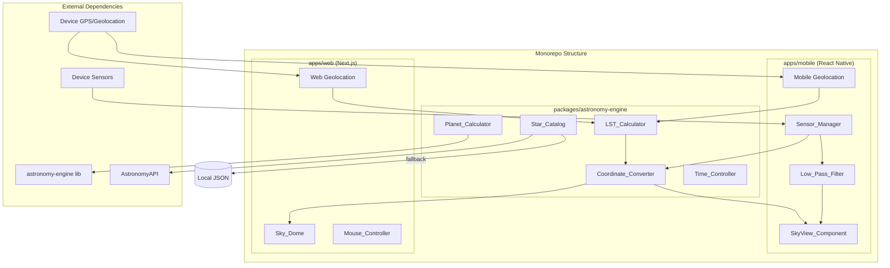
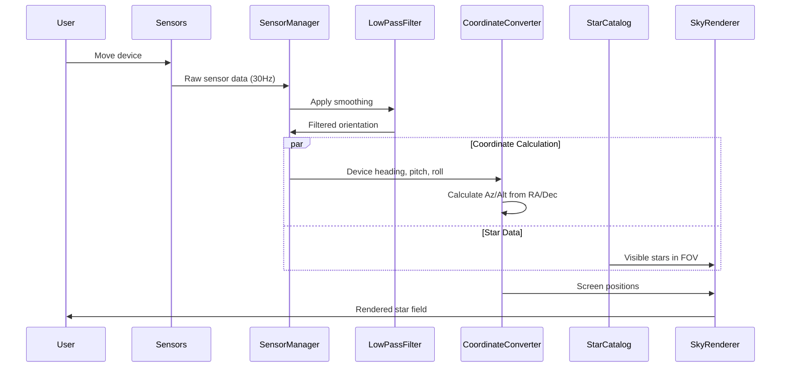
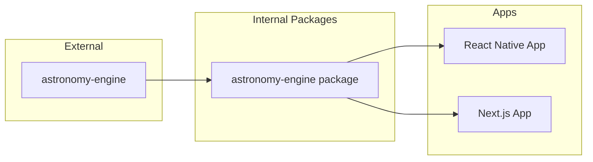

# Technical Design Document: Virtual Window Stargazing App

## Overview

Virtual Window is a cross-platform stargazing application that provides real-time celestial visualization using device sensors and GPS. The app transforms celestial coordinates (Right Ascension/Declination) to screen coordinates (Azimuth/Altitude), enabling users to point their device at the sky and identify stars and planets.

The solution employs a monorepo architecture with:
- **Mobile App**: React Native with react-native-svg for 2D star field rendering
- **Web App**: Next.js with Three.js/react-three-fiber for 3D sky dome visualization
- **Shared Package**: Astronomy_Engine containing all celestial calculations

Key technical challenges addressed:
1. Real-time sensor data processing with low-pass filtering to reduce jitter
2. Accurate astronomical coordinate transformations using Local Sidereal Time
3. Cross-platform code sharing while respecting platform-specific rendering requirements
4. Efficient star catalog management with API + local fallback strategy

## Architecture



### Data Flow Architecture



### Package Dependency Graph



## Components and Interfaces

### 1. Astronomy_Engine Package

The core shared package with zero platform-specific dependencies.

```typescript
// packages/astronomy-engine/src/index.ts

export interface GeographicCoordinates {
  latitude: number;   // -90 to +90 degrees
  longitude: number;  // -180 to +180 degrees
}

export interface CelestialCoordinates {
  ra: number;         // Right Ascension: 0-24 hours or 0-360 degrees
  dec: number;        // Declination: -90 to +90 degrees
}

export interface HorizontalCoordinates {
  azimuth: number;    // 0-360 degrees, clockwise from north
  altitude: number;   // -90 to +90 degrees
}

export interface Star {
  id: string;
  name: string | null;
  ra: number;
  dec: number;
  magnitude: number;
  spectralType: SpectralType;
}

export type SpectralType = 'O' | 'B' | 'A' | 'F' | 'G' | 'K' | 'M';

export interface Planet {
  id: string;
  name: string;
  ra: number;
  dec: number;
  magnitude: number;
}
```

### 2. LST_Calculator Interface

```typescript
// packages/astronomy-engine/src/lst-calculator.ts

export interface LSTCalculator {
  /**
   * Computes Local Sidereal Time from geographic position and UTC timestamp
   * @param longitude - Observer longitude in degrees (-180 to +180)
   * @param timestamp - UTC timestamp (Date object or ISO string)
   * @returns LST as decimal hours (0 to 24)
   */
  calculateLST(longitude: number, timestamp: Date | string): number;
  
  /**
   * Converts LST back to approximate UTC (for round-trip validation)
   * @param lst - Local Sidereal Time in decimal hours
   * @param longitude - Observer longitude in degrees
   * @param referenceDate - Reference date for calculation
   * @returns Approximate UTC timestamp
   */
  lstToUTC(lst: number, longitude: number, referenceDate: Date): Date;
}
```

### 3. Coordinate_Converter Interface

```typescript
// packages/astronomy-engine/src/coordinate-converter.ts

export interface CoordinateConverter {
  /**
   * Converts celestial coordinates to horizontal coordinates
   * @param celestial - RA/Dec coordinates
   * @param observer - Geographic position
   * @param lst - Local Sidereal Time in decimal hours
   * @returns Azimuth/Altitude coordinates
   */
  celestialToHorizontal(
    celestial: CelestialCoordinates,
    observer: GeographicCoordinates,
    lst: number
  ): HorizontalCoordinates;
  
  /**
   * Converts horizontal coordinates back to celestial (for validation)
   * @param horizontal - Az/Alt coordinates
   * @param observer - Geographic position
   * @param lst - Local Sidereal Time in decimal hours
   * @returns RA/Dec coordinates
   */
  horizontalToCelestial(
    horizontal: HorizontalCoordinates,
    observer: GeographicCoordinates,
    lst: number
  ): CelestialCoordinates;
  
  /**
   * Converts RA from hours to degrees
   */
  raHoursToDegrees(raHours: number): number;
  
  /**
   * Converts RA from degrees to hours
   */
  raDegreesToHours(raDegrees: number): number;
}
```

### 4. Star_Catalog Interface

```typescript
// packages/astronomy-engine/src/star-catalog.ts

export interface StarCatalogConfig {
  apiEndpoint?: string;
  apiKey?: string;
  localCatalogPath: string;
  maxMagnitude: number;
}

export interface StarCatalog {
  /**
   * Initializes the catalog, attempting API fetch with local fallback
   */
  initialize(): Promise<void>;
  
  /**
   * Returns all stars up to specified magnitude
   */
  getStars(maxMagnitude?: number): Star[];
  
  /**
   * Returns all planets with current positions
   */
  getPlanets(): Planet[];
  
  /**
   * Returns stars within the specified field of view
   */
  getVisibleStars(
    center: HorizontalCoordinates,
    fov: number,
    maxMagnitude?: number
  ): Star[];
  
  /**
   * Updates planet positions for given timestamp
   */
  updatePlanetPositions(timestamp: Date, observer: GeographicCoordinates): void;
  
  /**
   * Returns true if using cached/local data
   */
  isOfflineMode(): boolean;
}
```

### 5. Low_Pass_Filter Interface

```typescript
// apps/mobile/src/sensors/low-pass-filter.ts

export interface Vector3D {
  x: number;
  y: number;
  z: number;
}

export interface LowPassFilter {
  /**
   * Creates a new filter instance with specified smoothing factor
   * @param alpha - Smoothing factor (0 to 1)
   *   - Closer to 0: smoother but more delayed
   *   - Closer to 1: more responsive but noisier
   */
  constructor(alpha: number);
  
  /**
   * Applies filter to new sensor reading
   * @param input - Raw sensor reading
   * @returns Filtered reading
   */
  filter(input: Vector3D): Vector3D;
  
  /**
   * Resets filter state
   */
  reset(): void;
  
  /**
   * Updates smoothing factor
   */
  setAlpha(alpha: number): void;
  
  /**
   * Gets current smoothing factor
   */
  getAlpha(): number;
}
```

### 6. Sensor_Manager Interface (Mobile)

```typescript
// apps/mobile/src/sensors/sensor-manager.ts

export interface DeviceOrientation {
  heading: number;  // Yaw: 0-360 degrees
  pitch: number;    // -90 to +90 degrees
  roll: number;     // -180 to +180 degrees
}

export interface SensorStatus {
  magnetometer: 'available' | 'unavailable' | 'denied';
  accelerometer: 'available' | 'unavailable' | 'denied';
  gyroscope: 'available' | 'unavailable' | 'denied';
}

export interface SensorManager {
  /**
   * Initializes sensors and requests permissions
   */
  initialize(): Promise<SensorStatus>;
  
  /**
   * Starts sensor updates at specified rate
   * @param updateRateHz - Update frequency (minimum 30Hz)
   */
  startUpdates(updateRateHz: number): void;
  
  /**
   * Stops sensor updates
   */
  stopUpdates(): void;
  
  /**
   * Subscribes to filtered orientation updates
   */
  onOrientationChange(callback: (orientation: DeviceOrientation) => void): () => void;
  
  /**
   * Sets low-pass filter smoothing factor
   */
  setFilterAlpha(alpha: number): void;
  
  /**
   * Gets current sensor status
   */
  getStatus(): SensorStatus;
}
```

### 7. Sky_Renderer Interface (Shared Contract)

```typescript
// packages/astronomy-engine/src/renderer-types.ts

export interface RenderableStar {
  id: string;
  name: string | null;
  screenX: number;
  screenY: number;
  radius: number;        // Based on magnitude
  color: string;         // Based on spectral type
  magnitude: number;
  isVisible: boolean;    // Within FOV and above horizon
}

export interface RenderablePlanet {
  id: string;
  name: string;
  screenX: number;
  screenY: number;
  magnitude: number;
  isVisible: boolean;
}

export interface SkyRendererConfig {
  fov: number;           // Field of view in degrees (30-120)
  maxMagnitude: number;  // Maximum star magnitude to render
  showLabels: boolean;   // Show star/planet names
  labelMagnitudeThreshold: number;  // Only label stars brighter than this
}

export interface SkyRendererState {
  orientation: DeviceOrientation | CameraOrientation;
  observer: GeographicCoordinates;
  timestamp: Date;
  fov: number;
}
```

### 8. SkyView_Component (Mobile)

```typescript
// apps/mobile/src/components/SkyView.tsx

export interface SkyViewProps {
  stars: RenderableStar[];
  planets: RenderablePlanet[];
  config: SkyRendererConfig;
  onStarPress?: (star: RenderableStar) => void;
  onPlanetPress?: (planet: RenderablePlanet) => void;
  onFovChange?: (fov: number) => void;
}
```

### 9. Sky_Dome (Web)

```typescript
// apps/web/src/components/SkyDome.tsx

export interface CameraOrientation {
  azimuth: number;
  altitude: number;
  fov: number;
}

export interface SkyDomeProps {
  stars: Star[];
  planets: Planet[];
  config: SkyRendererConfig;
  onStarClick?: (star: Star) => void;
  onPlanetClick?: (planet: Planet) => void;
  onCameraChange?: (orientation: CameraOrientation) => void;
}
```

### 10. Time_Controller Interface

```typescript
// packages/astronomy-engine/src/time-controller.ts

export interface TimeController {
  /**
   * Gets the currently selected timestamp
   */
  getCurrentTime(): Date;
  
  /**
   * Sets a specific timestamp for calculations
   */
  setTime(timestamp: Date): void;
  
  /**
   * Returns to real-time mode
   */
  setRealTime(): void;
  
  /**
   * Checks if in real-time mode
   */
  isRealTime(): boolean;
  
  /**
   * Gets the valid time range (±1 year from now)
   */
  getTimeRange(): { min: Date; max: Date };
  
  /**
   * Subscribes to time changes
   */
  onTimeChange(callback: (timestamp: Date) => void): () => void;
}
```


## Data Models

### Star Data Model

```typescript
interface StarRecord {
  id: string;                    // Unique identifier (e.g., HIP number)
  name: string | null;           // Common name (e.g., "Sirius", "Vega")
  ra: number;                    // Right Ascension in decimal hours (0-24)
  dec: number;                   // Declination in degrees (-90 to +90)
  magnitude: number;             // Apparent magnitude (≤5.0 for naked eye, ≤6.0 for zoom)
  spectralType: SpectralType;    // O, B, A, F, G, K, or M
}

// Spectral type to color mapping
const SPECTRAL_COLORS: Record<SpectralType, string> = {
  'O': '#9bb0ff',  // Blue
  'B': '#aabfff',  // Blue-white
  'A': '#cad7ff',  // White
  'F': '#f8f7ff',  // Yellow-white
  'G': '#fff4ea',  // Yellow
  'K': '#ffd2a1',  // Orange
  'M': '#ffcc6f',  // Red-orange
};
```

### Planet Data Model

```typescript
interface PlanetRecord {
  id: string;                    // Planet identifier
  name: string;                  // Planet name
  ra: number;                    // Current RA (computed dynamically)
  dec: number;                   // Current Dec (computed dynamically)
  magnitude: number;             // Current apparent magnitude
  symbol: string;                // Unicode symbol for rendering
}

const PLANETS: PlanetRecord[] = [
  { id: 'mercury', name: 'Mercury', symbol: '☿' },
  { id: 'venus', name: 'Venus', symbol: '♀' },
  { id: 'mars', name: 'Mars', symbol: '♂' },
  { id: 'jupiter', name: 'Jupiter', symbol: '♃' },
  { id: 'saturn', name: 'Saturn', symbol: '♄' },
  { id: 'uranus', name: 'Uranus', symbol: '♅' },
  { id: 'neptune', name: 'Neptune', symbol: '♆' },
  { id: 'earth', name: 'Earth', symbol: '⊕' },  // For reference only
];
```

### Sensor Data Model

```typescript
interface RawSensorData {
  magnetometer: Vector3D;        // Magnetic field (μT)
  accelerometer: Vector3D;       // Acceleration (m/s²)
  gyroscope: Vector3D;           // Angular velocity (rad/s)
  timestamp: number;             // Milliseconds since epoch
}

interface FilteredSensorData {
  magnetometer: Vector3D;
  accelerometer: Vector3D;
  gyroscope: Vector3D;
  orientation: DeviceOrientation;
  timestamp: number;
}
```

### Application State Model

```typescript
interface AppState {
  // Location
  observer: GeographicCoordinates | null;
  locationStatus: 'pending' | 'granted' | 'denied' | 'manual';
  
  // Time
  selectedTime: Date;
  isRealTime: boolean;
  
  // Sensors (mobile only)
  sensorStatus: SensorStatus | null;
  currentOrientation: DeviceOrientation | null;
  filterAlpha: number;
  
  // Rendering
  fov: number;
  maxMagnitude: number;
  showLabels: boolean;
  
  // Data
  stars: Star[];
  planets: Planet[];
  catalogStatus: 'loading' | 'online' | 'offline' | 'error';
  
  // UI
  selectedObject: Star | Planet | null;
  showInfoPanel: boolean;
}
```

### Local Storage Schema

```typescript
// For caching star catalog
interface CachedCatalog {
  version: string;
  fetchedAt: string;           // ISO timestamp
  stars: StarRecord[];
  expiresAt: string;           // ISO timestamp (24h from fetch)
}

// For user preferences
interface UserPreferences {
  defaultFov: number;
  filterAlpha: number;
  showLabels: boolean;
  labelMagnitudeThreshold: number;
  lastKnownLocation?: GeographicCoordinates;
}
```

### API Response Models

```typescript
// AstronomyAPI star response
interface AstronomyAPIStarResponse {
  data: {
    table: {
      rows: Array<{
        cells: Array<{
          id: string;
          name: string;
          position: {
            equatorial: {
              rightAscension: { hours: number };
              declination: { degrees: number };
            };
          };
          extraInfo: {
            magnitude: number;
            spectralType: string;
          };
        }>;
      }>;
    };
  };
}
```

### Coordinate Transformation Constants

```typescript
// Mathematical constants for coordinate calculations
const ASTRONOMY_CONSTANTS = {
  // Julian date of J2000.0 epoch
  J2000: 2451545.0,
  
  // Days per Julian century
  DAYS_PER_CENTURY: 36525,
  
  // Degrees per hour of RA
  DEGREES_PER_HOUR: 15,
  
  // Sidereal day in solar hours
  SIDEREAL_DAY_HOURS: 23.9344696,
  
  // Earth's axial tilt (obliquity) in degrees
  OBLIQUITY: 23.439281,
};
```

### Magnitude to Radius Mapping

```typescript
// Convert apparent magnitude to screen radius
function magnitudeToRadius(magnitude: number, baseFov: number): number {
  // Brighter stars (lower magnitude) get larger radius
  // Magnitude scale is logarithmic: each magnitude is ~2.512x brightness
  const baseRadius = 3;
  const scaleFactor = Math.pow(2.512, (2 - magnitude) / 2);
  const fovScale = 60 / baseFov;  // Adjust for zoom level
  return Math.max(1, baseRadius * scaleFactor * fovScale);
}
```


## Correctness Properties

*A property is a characteristic or behavior that should hold true across all valid executions of a system—essentially, a formal statement about what the system should do. Properties serve as the bridge between human-readable specifications and machine-verifiable correctness guarantees.*

### Property 1: LST Round-Trip

*For any* valid geographic longitude and UTC timestamp, computing Local Sidereal Time and then converting back to UTC shall produce a timestamp within 1 second of the original.

**Validates: Requirements 3.5**

### Property 2: Coordinate Conversion Round-Trip

*For any* valid celestial coordinates (RA/Dec), observer position (latitude/longitude), and Local Sidereal Time, converting to horizontal coordinates (Az/Alt) and then back to celestial coordinates shall produce values within 0.01 degrees of the original.

**Validates: Requirements 4.7**

### Property 3: Low-Pass Filter Cascade Property

*For any* input sequence of sensor readings, applying the exponential moving average filter twice with alpha=0.5 shall produce the same steady-state result as applying the filter once with alpha=0.25.

**Validates: Requirements 10.6**

### Property 4: Geographic Coordinate Validation

*For any* latitude value, the system shall accept it if and only if it falls within the range [-90, +90] degrees. *For any* longitude value, the system shall accept it if and only if it falls within the range [-180, +180] degrees.

**Validates: Requirements 2.2, 2.3**

### Property 5: Coordinate Precision Preservation

*For any* geographic coordinate input with decimal precision, the stored coordinate shall maintain at least 4 decimal places of precision (approximately 11 meters accuracy).

**Validates: Requirements 2.5**

### Property 6: LST Output Range

*For any* valid longitude and timestamp input, the computed Local Sidereal Time shall be a decimal hour value in the range [0, 24).

**Validates: Requirements 3.3**

### Property 7: Horizontal Coordinate Output Ranges

*For any* valid celestial coordinate conversion, the output azimuth shall be in the range [0, 360) degrees and the output altitude shall be in the range [-90, +90] degrees.

**Validates: Requirements 4.2, 4.3**

### Property 8: RA Format Equivalence

*For any* Right Ascension value, providing it in decimal hours (0-24) or in degrees (0-360) shall produce identical horizontal coordinate results after conversion.

**Validates: Requirements 4.4**

### Property 9: Below Horizon Marking

*For any* celestial object whose computed altitude is negative, the Sky_Renderer shall mark that object as below the horizon and exclude it from visible rendering.

**Validates: Requirements 4.6**

### Property 10: Star Data Completeness

*For any* star in the Star_Catalog, it shall contain all required fields: id, name (or null), RA, Dec, apparent magnitude, and spectral type.

**Validates: Requirements 5.2**

### Property 11: Magnitude-to-Radius Ordering

*For any* two stars with different apparent magnitudes, the star with the lower magnitude (brighter) shall be rendered with a larger circle radius than the star with the higher magnitude (dimmer).

**Validates: Requirements 6.2**

### Property 12: Field of View Visibility

*For any* star in the catalog and any device orientation, the star shall be rendered if and only if its angular distance from the view center is less than half the current field of view AND its altitude is non-negative.

**Validates: Requirements 6.4**

### Property 13: Star Label Threshold

*For any* star with apparent magnitude less than 2.0, the SkyView_Component shall display the star's name label. *For any* star with magnitude 2.0 or greater, the name label shall not be displayed (unless zoomed).

**Validates: Requirements 6.5**

### Property 14: Spectral Type Color Mapping

*For any* star with a valid spectral type (O, B, A, F, G, K, M), the rendered color shall match the defined color mapping: O/B→blue, A/F→white, G→yellow, K→orange, M→red.

**Validates: Requirements 6.7**

### Property 15: 3D Star Positioning

*For any* star placed on the Sky_Dome, its 3D position on the sphere shall correspond to its RA/Dec coordinates such that the angular position matches the celestial coordinates.

**Validates: Requirements 7.2**

### Property 16: Planet Position Calculation

*For any* valid timestamp and observer location, the Astronomy_Engine shall compute valid RA/Dec positions for all 8 planets, with positions matching the astronomy-engine library's calculations.

**Validates: Requirements 9.1**

### Property 17: Planet Visual Differentiation

*For any* planet rendered on screen, it shall be displayed with a distinct icon (not a circle) that differentiates it from stars, and shall always display its name label.

**Validates: Requirements 9.4, 9.5**

### Property 18: EMA Filter Formula

*For any* sensor reading sequence, the Low_Pass_Filter shall compute output using the exponential moving average formula: output[n] = alpha * input[n] + (1 - alpha) * output[n-1].

**Validates: Requirements 10.1**

### Property 19: Filter Alpha Range

*For any* alpha value provided to the Low_Pass_Filter, it shall be accepted if and only if it falls within the range [0, 1]. The Sensor_Manager shall constrain its filter alpha to [0.1, 0.5].

**Validates: Requirements 10.2, 1.3**

### Property 20: Filter Smoothness vs Alpha

*For any* noisy input sequence, applying the filter with a lower alpha value shall produce output with lower variance (smoother) than applying with a higher alpha value.

**Validates: Requirements 10.3, 10.4**

### Property 21: Independent Axis Filtering

*For any* 3D sensor input (x, y, z), the filter shall process each axis independently such that the filtered x value depends only on previous x values, and similarly for y and z.

**Validates: Requirements 10.5**

### Property 22: FOV Range Constraint

*For any* field of view value set by the user, the Sky_Renderer shall constrain it to the range [30, 120] degrees.

**Validates: Requirements 11.1**

### Property 23: FOV-Dependent Magnitude Threshold

*For any* field of view less than 45 degrees, the Sky_Renderer shall display stars up to magnitude 6.0. *For any* FOV of 45 degrees or greater, the magnitude threshold shall be 5.0.

**Validates: Requirements 11.5**

### Property 24: Time Range Constraint

*For any* timestamp selected via the time slider, it shall be constrained to within ±1 year (365 days) of the current date.

**Validates: Requirements 12.2**

### Property 25: Arbitrary Timestamp Acceptance

*For any* valid Date object or ISO timestamp string within the allowed range, the Astronomy_Engine shall accept it and compute celestial positions accordingly.

**Validates: Requirements 12.1**

### Property 26: Sensor Orientation Computation

*For any* valid raw sensor data (magnetometer, accelerometer, gyroscope), the Sensor_Manager shall compute a valid device orientation with heading in [0, 360), pitch in [-90, +90], and roll in [-180, +180].

**Validates: Requirements 1.4**


## Error Handling

### Sensor Errors (Mobile)

| Error Condition | Handling Strategy | User Feedback |
|----------------|-------------------|---------------|
| Sensor permission denied | Disable sensor-based tracking, enable manual pan | Modal explaining required permissions with link to settings |
| Magnetometer unavailable | Use accelerometer + gyroscope only, reduced accuracy | Toast: "Compass unavailable - heading may drift" |
| All sensors unavailable | Fall back to manual touch/drag navigation | Banner: "Sensors unavailable - using manual navigation" |
| Sensor data invalid/NaN | Skip frame, use last valid reading | None (silent recovery) |

### Location Errors

| Error Condition | Handling Strategy | User Feedback |
|----------------|-------------------|---------------|
| GPS permission denied | Show manual coordinate entry form | Modal with lat/long input fields |
| GPS timeout | Retry 3 times, then prompt manual entry | "Unable to determine location. Enter manually?" |
| GPS unavailable (web) | Use IP-based geolocation fallback | "Using approximate location based on IP" |
| Invalid manual coordinates | Reject input, highlight invalid field | Inline validation: "Latitude must be -90 to +90" |
| Location undetermined | Default to (0, 0) equator/prime meridian | Warning banner: "Location unknown - showing equatorial sky" |

### Data Loading Errors

| Error Condition | Handling Strategy | User Feedback |
|----------------|-------------------|---------------|
| API fetch failed | Load bundled local JSON catalog | Toast: "Using offline star catalog" |
| API rate limited | Use cached data if available, else local | Toast: "API limit reached - using cached data" |
| Local catalog missing | Show error, app cannot function | Error screen: "Star data unavailable. Please reinstall." |
| Catalog parse error | Attempt recovery, fall back to minimal data | Toast: "Some star data may be missing" |
| Planet calculation error | Skip affected planet, show others | Console warning only |

### Rendering Errors (Web)

| Error Condition | Handling Strategy | User Feedback |
|----------------|-------------------|---------------|
| WebGL unavailable | Fall back to 2D canvas rendering | Banner: "3D view unavailable - using 2D mode" |
| WebGL context lost | Attempt context restoration | Brief loading indicator |
| Canvas too large | Reduce resolution | None (automatic adjustment) |
| Memory exceeded | Reduce star count, disable labels | Toast: "Reduced detail for performance" |

### Time Control Errors

| Error Condition | Handling Strategy | User Feedback |
|----------------|-------------------|---------------|
| Invalid timestamp | Clamp to valid range | Slider snaps to nearest valid date |
| Calculation timeout | Use cached positions | None (silent fallback) |
| Date parsing error | Default to current time | Toast: "Invalid date - showing current sky" |

### Error Recovery Patterns

```typescript
// Retry with exponential backoff
async function fetchWithRetry<T>(
  fn: () => Promise<T>,
  maxRetries: number = 3,
  baseDelay: number = 1000
): Promise<T> {
  for (let attempt = 0; attempt < maxRetries; attempt++) {
    try {
      return await fn();
    } catch (error) {
      if (attempt === maxRetries - 1) throw error;
      await sleep(baseDelay * Math.pow(2, attempt));
    }
  }
  throw new Error('Max retries exceeded');
}

// Graceful degradation for sensors
function getAvailableSensors(status: SensorStatus): string[] {
  return Object.entries(status)
    .filter(([_, state]) => state === 'available')
    .map(([sensor]) => sensor);
}
```

## Testing Strategy

### Dual Testing Approach

This project requires both unit tests and property-based tests for comprehensive coverage:

- **Unit tests**: Verify specific examples, edge cases, integration points, and error conditions
- **Property tests**: Verify universal properties across randomized inputs (minimum 100 iterations per property)

### Property-Based Testing Configuration

**Library**: [fast-check](https://github.com/dubzzz/fast-check) for TypeScript/JavaScript

**Configuration**:
```typescript
// jest.config.js or vitest.config.ts
{
  testTimeout: 30000,  // Allow time for 100+ iterations
}

// Property test setup
import fc from 'fast-check';

const propertyTestConfig = {
  numRuns: 100,        // Minimum iterations per property
  verbose: true,       // Show counterexamples on failure
  seed: Date.now(),    // Reproducible with logged seed
};
```

**Tagging Convention**: Each property test must include a comment referencing the design property:
```typescript
// Feature: stargazing-app, Property 1: LST Round-Trip
test.prop([validLongitude, validTimestamp], propertyTestConfig)(
  'LST round-trip produces original timestamp within 1 second',
  (longitude, timestamp) => { /* ... */ }
);
```

### Test Categories

#### 1. Astronomy Engine Tests (Property-Based)

| Property | Test Description | Generator Strategy |
|----------|------------------|-------------------|
| Property 1 | LST round-trip | Generate longitudes [-180, 180], timestamps within ±1 year |
| Property 2 | Coordinate conversion round-trip | Generate RA [0, 24], Dec [-90, 90], lat [-90, 90], lon [-180, 180] |
| Property 4 | Geographic coordinate validation | Generate numbers in extended range [-200, 200] |
| Property 6 | LST output range | Generate valid inputs, verify output in [0, 24) |
| Property 7 | Horizontal coordinate ranges | Generate celestial coords, verify Az [0, 360), Alt [-90, 90] |
| Property 8 | RA format equivalence | Generate RA in hours, convert to degrees, compare results |

#### 2. Low-Pass Filter Tests (Property-Based)

| Property | Test Description | Generator Strategy |
|----------|------------------|-------------------|
| Property 3 | Filter cascade property | Generate sensor sequences, compare alpha=0.5 twice vs alpha=0.25 once |
| Property 18 | EMA formula verification | Generate sequences, verify formula application |
| Property 19 | Alpha range validation | Generate alpha values [-1, 2], verify acceptance |
| Property 20 | Smoothness vs alpha | Generate noisy sequences, compare variance at different alphas |
| Property 21 | Independent axis filtering | Generate 3D inputs, verify axis independence |

#### 3. Rendering Logic Tests (Property-Based)

| Property | Test Description | Generator Strategy |
|----------|------------------|-------------------|
| Property 9 | Below horizon marking | Generate stars with various altitudes |
| Property 11 | Magnitude-to-radius ordering | Generate star pairs with different magnitudes |
| Property 12 | FOV visibility | Generate stars and orientations, verify visibility logic |
| Property 13 | Star label threshold | Generate stars with magnitudes around 2.0 |
| Property 14 | Spectral type colors | Generate stars with all spectral types |
| Property 22 | FOV range constraint | Generate FOV values outside [30, 120] |
| Property 23 | FOV-dependent magnitude | Generate FOV values around 45 degree threshold |

#### 4. Unit Tests (Example-Based)

**Coordinate Conversion Examples**:
- Polaris (RA 2h31m, Dec +89°15') from various locations
- Zenith point verification (altitude = 90° at observer's position)
- Horizon points (altitude = 0°)
- Known star positions at specific times

**Edge Cases**:
- Coordinates at poles (lat = ±90°)
- Date line crossing (lon = ±180°)
- Midnight/noon LST transitions
- Stars exactly on horizon (altitude = 0°)
- FOV boundary conditions (30° and 120°)

**Error Handling**:
- Invalid coordinate inputs
- Missing sensor data
- API failure scenarios
- WebGL unavailability

### Test File Structure

```
packages/astronomy-engine/
├── src/
│   ├── __tests__/
│   │   ├── lst-calculator.property.test.ts
│   │   ├── lst-calculator.unit.test.ts
│   │   ├── coordinate-converter.property.test.ts
│   │   ├── coordinate-converter.unit.test.ts
│   │   ├── star-catalog.unit.test.ts
│   │   └── generators/
│   │       ├── coordinates.ts
│   │       ├── timestamps.ts
│   │       └── stars.ts

apps/mobile/
├── src/
│   ├── __tests__/
│   │   ├── low-pass-filter.property.test.ts
│   │   ├── sensor-manager.unit.test.ts
│   │   └── sky-view.unit.test.ts

apps/web/
├── src/
│   ├── __tests__/
│   │   ├── sky-dome.unit.test.ts
│   │   └── webgl-fallback.unit.test.ts
```

### Custom Generators

```typescript
// packages/astronomy-engine/src/__tests__/generators/coordinates.ts
import fc from 'fast-check';

export const validLatitude = fc.double({ min: -90, max: 90, noNaN: true });
export const validLongitude = fc.double({ min: -180, max: 180, noNaN: true });
export const validRA = fc.double({ min: 0, max: 24, noNaN: true });
export const validDec = fc.double({ min: -90, max: 90, noNaN: true });

export const geographicCoordinates = fc.record({
  latitude: validLatitude,
  longitude: validLongitude,
});

export const celestialCoordinates = fc.record({
  ra: validRA,
  dec: validDec,
});

export const validTimestamp = fc.date({
  min: new Date(Date.now() - 365 * 24 * 60 * 60 * 1000),
  max: new Date(Date.now() + 365 * 24 * 60 * 60 * 1000),
});

export const spectralType = fc.constantFrom('O', 'B', 'A', 'F', 'G', 'K', 'M');

export const star = fc.record({
  id: fc.uuid(),
  name: fc.option(fc.string({ minLength: 1, maxLength: 20 })),
  ra: validRA,
  dec: validDec,
  magnitude: fc.double({ min: -2, max: 6, noNaN: true }),
  spectralType: spectralType,
});
```

### Integration Tests

- **Cross-platform consistency**: Verify Astronomy_Engine produces identical results when imported by both web and mobile apps
- **Catalog loading**: Test API fetch → cache → offline fallback flow
- **Sensor pipeline**: Test raw data → filter → orientation → screen position flow
- **Time control**: Test time slider → recalculation → render update flow

### Performance Benchmarks

- Coordinate conversion: < 1ms per star
- Full sky recalculation (5000 stars): < 100ms
- Filter application: < 0.1ms per reading
- Render frame (visible stars): < 33ms (30fps)

